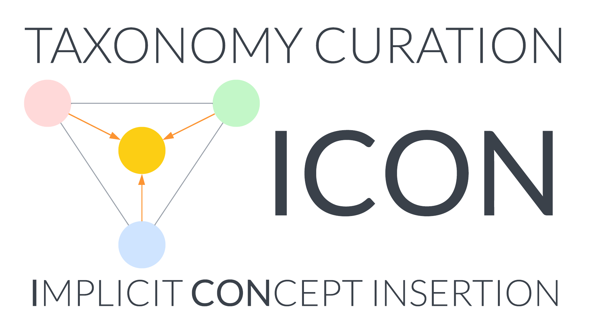

# ICON



**ICON** (**I**mplicit **CON**cept Insertion) is a self-supervised taxonomy enrichment system. It discovers implicit intermediate concepts missing from an existing taxonomy by:

1. Retrieving a cluster of related concepts via an embedding model (`emb_model`)
2. Generating a virtual concept label for each subset via a generative model (`gen_model`)
3. Placing the concept via subsumption-prediction-based search (`sub_model`)

## Dependencies

Core: `numpy`, `owlready2`, `networkx`, `faiss`, `tqdm`, `nltk`  
Sub-model training: `torch`, `pandas`, `transformers`, `datasets`, `evaluate`, `info-nce-pytorch`  
Python ≥ 3.9

## Quick start

```python
from icon import ICON, from_json

taxo = from_json("data/raw/google.json")
icon = ICON(data=taxo, emb_model=emb, gen_model=gen, sub_model=sub)
icon.run()  # auto mode — enriches entire taxonomy
```

See [`demo.ipynb`](./demo.ipynb) for a full walkthrough including model wrapping.

## Sub-models

ICON requires three plug-in models with these signatures:

| Model | Signature | Purpose |
|-------|-----------|---------|
| `emb_model` | `(query: List[str], ...) -> np.ndarray` | Embed concepts for retrieval |
| `gen_model` | `(labels: List[str], ...) -> str` | Generate union label for a subset |
| `sub_model` | `(sub, sup, ...) -> np.ndarray` | Predict subsumption probability |

`emb_model` and `gen_model` are optional depending on the operating mode (see [configuration](docs/configuration.md)).

We provide a fine-tuning pipeline using BERT (emb/sub) and T5 (gen). See [fine-tuning data reference](docs/fine-tuning-data.md) and the notebooks under `experiments/model_training/`.

## Documentation

- [Configuration reference](docs/configuration.md) — all ICON parameters explained
- [Fine-tuning data reference](docs/fine-tuning-data.md) — `data_config.json` parameters for each sub-model
- [Taxonomy file format](docs/taxonomy-format.md) — JSON schema for reading/writing taxonomies

## Citation

```bibtex
@inproceedings{10.1145/3589334.3645584,
  author    = {Shi, Jingchuan and Dong, Hang and Chen, Jiaoyan and Wu, Zhe and Horrocks, Ian},
  title     = {Taxonomy Completion via Implicit Concept Insertion},
  year      = {2024},
  publisher = {Association for Computing Machinery},
  booktitle = {Proceedings of the ACM on Web Conference 2024},
  pages     = {2159--2169},
  series    = {WWW '24}
}
```
